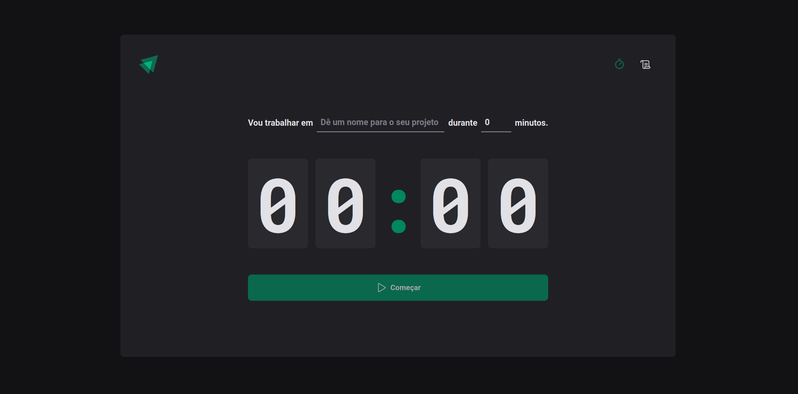
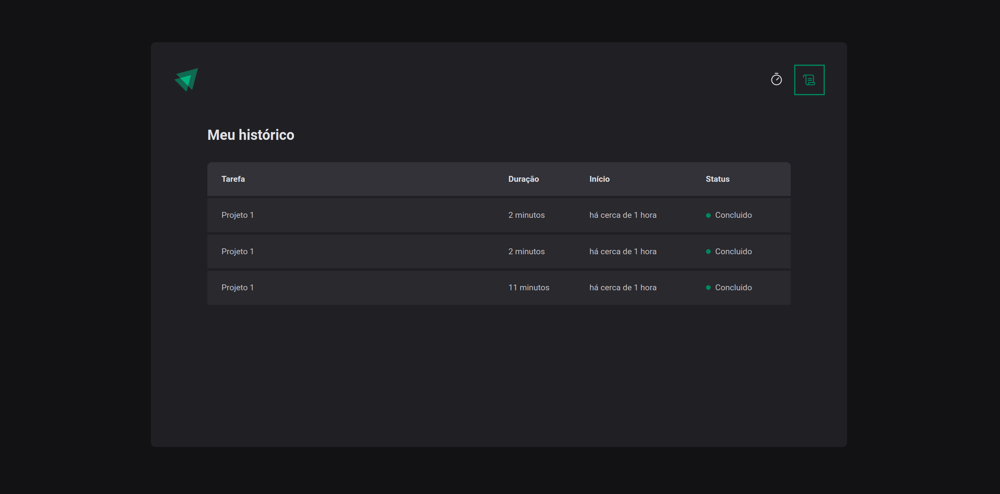

# Pomodoro

###
The Pomodoro Technique is a time management method that can be used for any task. For many people, time is an enemy. 
The anxiety triggered by “the ticking clock”, especially when it involves a deadline, leads to ineffective work and 
study habits which in turn lead to procrastination.

The aim of the Pomodoro Technique is to use time as a valuable ally in accomplishing what we want to do in the way 
we want to do it, and to enable us to improve continually the way we work or study.

## This project was created using ViteJS

Why Vite ? 

You can check more about the benefits of Vite in: https://vitejs.dev/guide/why.html

## How to run this project

In the project directory, you can run:

### `Yarn`

yarn && yarn dev

### `Npm`

npm install && npm start

## Technologies used

- ReactJS

## Libraries used

- styled components
- react-hook-form
- zod
- immer
- date-fns
- react-router-dom
- phosphor-react

### Assumptions

## Home page

This step is the entry point, and the user can start the Pomodoro clock and interrupt if wants to.

## History page

This is where the user can check his Pomodoro's history and also see if a Pomodoro was finished, interrupted or if the timer is
still ongoing.

## TODO

[ ] layout.
[ ] unit tests.

